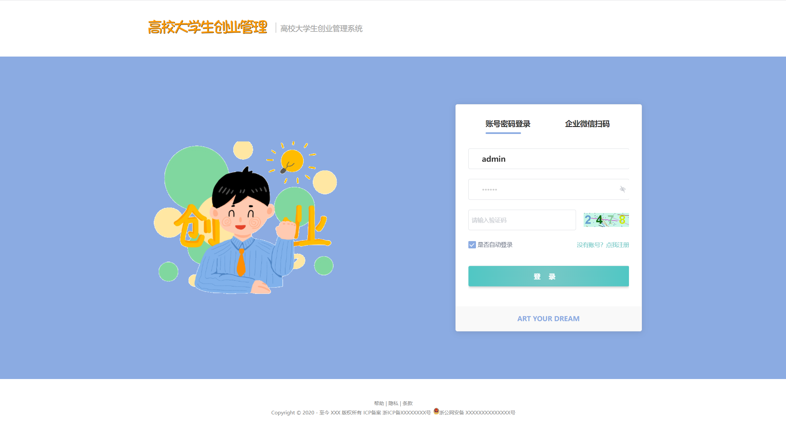
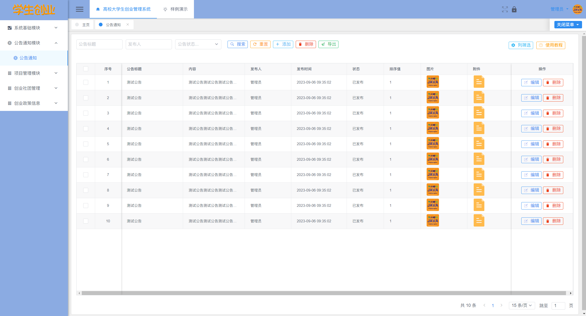
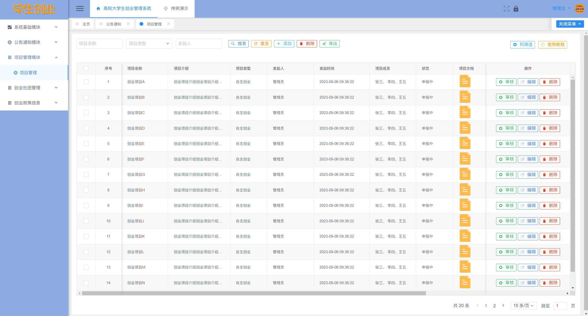
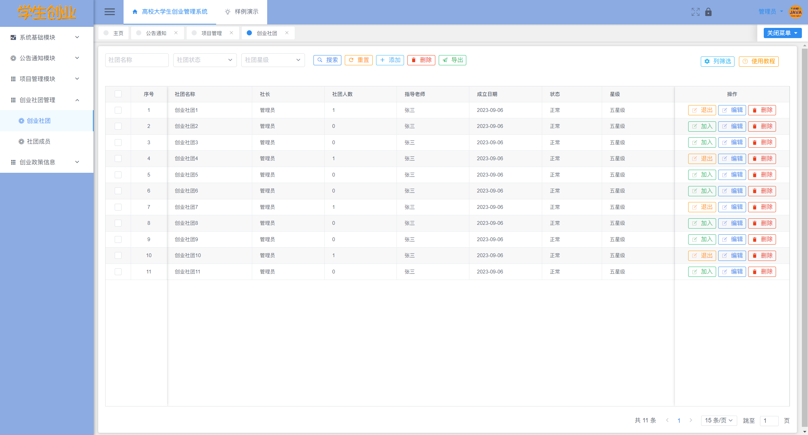
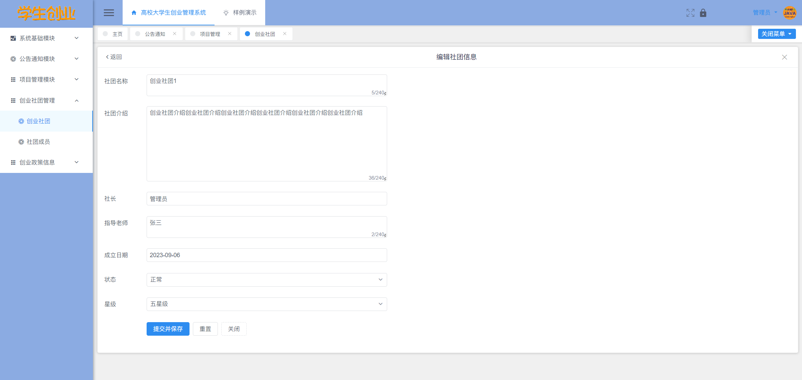
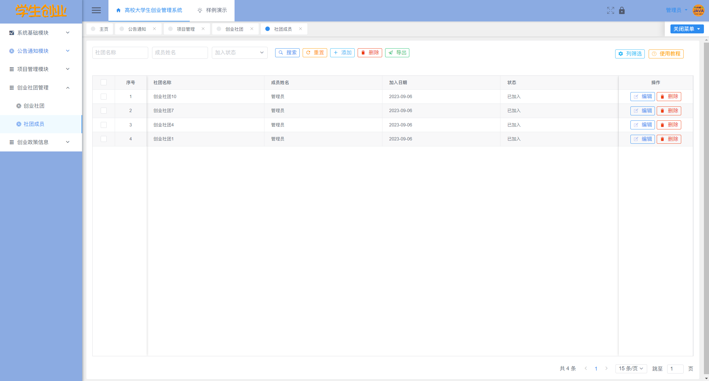
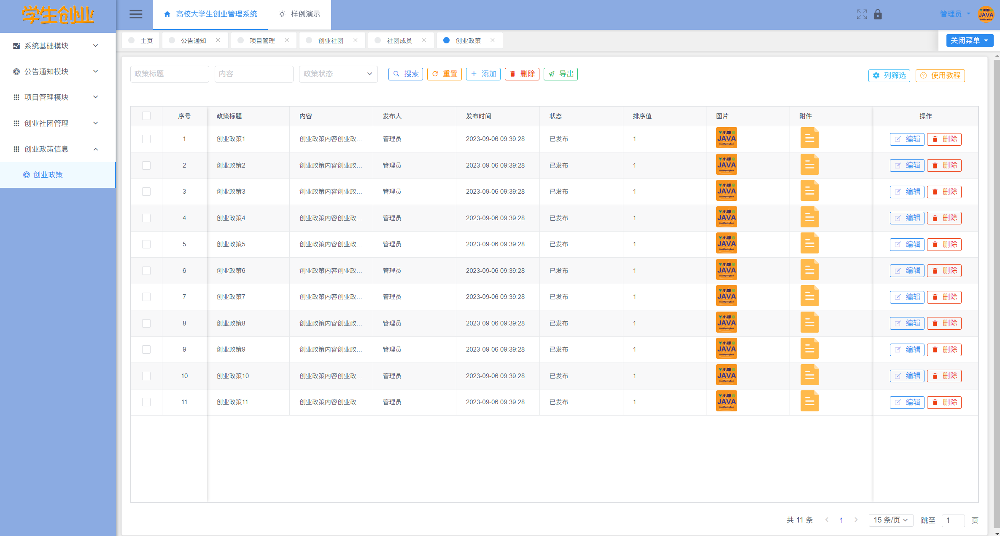
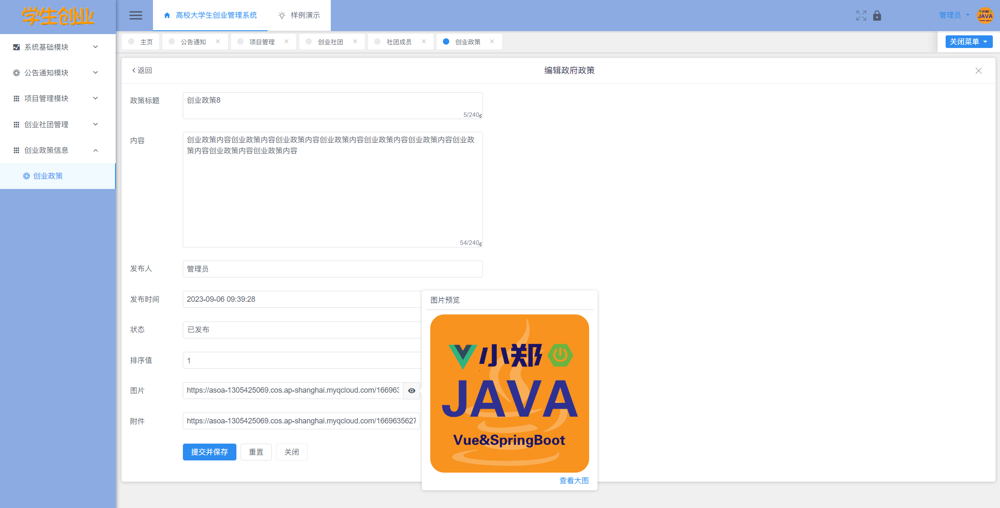

# **高校大学生创业管理系统**

## 软件简介

高校大学生创业管理系统，以帮助初创企业更好地管理其业务活动，高校大学生创业管理系统拥有系统公告、创业项目、创业社团、创业政策模块，通过该系统，初创企业可以更加高效地完成项目，优化资源利用，合理分配预算，并提升销售业绩，适应不同规模的企业和各种管理需求。

高校大学生创业管理系统，以 Vue 为前端，SpirngBoot为后端，MySQL为数据库，高校大学生创业管理系统可以展示高校对于创业的基本政策、补贴措施、成功案例，解决学生创业中的实际问题，提升高校的创业率。

| 项目交流 | https://bbs.csdn.net/topics/617197217 |
| -------- | ------------------------------------- |

## 项目技术

本资源仅供个人学习使用，如需获取源码请自助下载，谢谢配合。

前端： Node.js 18，Vue 2.7.10。

后端：JDK 17，Maven 3.6，Spring Boot 3.1.0，mybatis-plus 3.5.3.1。

数据库：MySQL 8.0.33，Redis 5.0.14。

## 系统截图

下面是系统截图，相信聪明的读者都能看懂！

## 免责声明

- 本项目仅供个人学习使用，遵循 GPL-3.0 协议，**商用授权请联系作者，否则后果自负**。
- 作者拥有本软件构建后的应用系统全部内容所有权及独立的知识产权。
- 如有问题，欢迎在仓库 Issue 留言，看到后会第一时间回复。相关意见会酌情考虑，但没有一定被采纳的承诺或保证。

下载本系统代码的用户，**必须同意以下内容，否则请勿下载**！

1. 出于自愿而使用/开发本软件，了解使用本软件的风险，且同意自己承担使用本软件的风险。
2. 利用本软件构建的网站的任何信息内容以及导致的任何版权纠纷和法律争议及后果和作者无关，作者对此不承担任何责任。
3. 在任何情况下，对于因使用或无法使用本软件而导致的任何难以合理预估的损失（包括但不仅限于商业利润损失、业务中断与业务信息丢失），作者概不承担任何责任。
4. 必须了解使用本软件的风险，作者不承诺提供一对一的技术支持、使用担保，也不承担任何因本软件而产生的难以预料的问题的相关责任。
